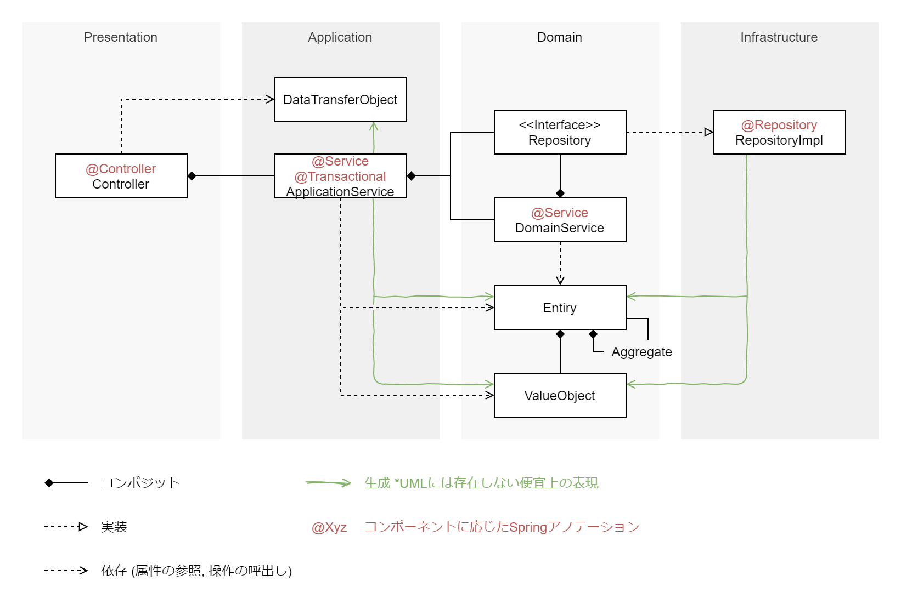

エヴァンスが2003年に書籍 Domain-Driven Design で紹介してから早17年。
やっと時代が追いつき、近年ではこれまでにないほど DDD が注目を集めている。
注目が高まるとともに、DDD を取り扱う良質な書籍も増え、
私自身も複数の DDD の実践を経て、以前よりも理解は進んできたように思う。

そこで、私の現時点での DDD に対する解釈を、一度ここに書き起こし、残してみようと思う。
(これはあくまで現時点での解釈であり、解釈のアップデートがあれば書き換えるかもしれない。)

なお本稿では、ドメインエキスパートや、ユビキタス言語といった、
DDD のプロジェクトへの適用側面には触れず、あくまでプログラミングする際に
どのように理解、適用していけばよいかを中心に見ていく。

----

2011年9月、Spring Framework 3.0.6がリリースされて間もない頃、Spring の API ドキュメント内に DDD の文字を見つけることができるようになる。

https://github.com/spring-projects/spring-framework/blob/15a8f776b9436fa8a74fc73b7004fdf830879c77/org.springframework.context/src/main/java/org/springframework/stereotype/Service.java#L26-L28

> Indicates that an annotated class is a "Service", originally defined by Domain-Driven
> Design (Evans, 2003) as "an operation offered as an interface that stands alone in the
> model, with no encapsulated state."

書籍での言及からは8年ほど経過しているが、2020年現在から遡ること9年も前のことである。現在公開されている API ドキュメントとしては、以下のステレオタイプアノテーションでそれを確認できる。

* [stereotype/Service](https://docs.spring.io/spring/docs/current/javadoc-api/org/springframework/stereotype/Service.html)
* [stereotype/Repository](https://docs.spring.io/spring/docs/current/javadoc-api/org/springframework/stereotype/Repository.html)

さて、DDD に対する言及のあるステレオタイプアノテーションではあるが、
これらは実際に、どのようなクラスに適用していけばよいのだろうか。

DDD を理解する上では、いきなり DDD の用語や概念を学ぶよりも、
従来の慣れ親しんだアーキテクチャとの差分を確認しながら比較をしたほうが、
イメージを膨らませやすくなるように思う。

そこで、ここではトランザクションスクリプト方式のアーキテクチャと、
DDD 方式のアーキテクチャで、コンポーネントがどのように分割されるのかを比較して確認してみようと思う。

## トランザクションスクリプト
https://bliki-ja.github.io/pofeaa/TransactionScript/

従来のビジネスロジックや、ビジネスサービスファサードを使用したクラスの責務分割を行う場合、
トランザクションスクリプトと呼ばれるアーキテクチャを使用するのが一般的かと思う。

図に起こすと以下のような形になる。

ここでは、3層アーキテクチャにトランザクションスクリプトを適用した場合の例を挙げている。

トランザクションスクリプトは構造がシンプルでわかりやすい反面、トランザクションスクリプトという名前でも表現されている通り、目的の主体はあくまでトランザクションの処理である。

これはドメインの文脈上どのような意味、目的を持っているかについてはあまり重視しておらず、アプリケーションのユースケースを達成することを、目的としている。

これはアプリケーションを構築する上では、十分に機能し、問題に感じられることも多くはないだろう。ところが現代において、アプリケーションは頻繁に変わり、様々な顔 (CLI, GUI, API, etc..) を持っているものである。

しかしアプリケーション要求の変化とは別に、頻繁には変化することなく、アプリケーションがどのような顔をしていても、普遍であるものがある。それがドメインなのである。ドメイン駆動は、このドメインに着目し、うまく取り扱うためのプラクティスとなっている。

## DDD
それでは、トランザクションスクリプトと比較した場合、DDD ではどのようにコンポーネントを分割、配置していくのか。
DDD では責務に応じて定義されるコンポーネントが、トランザクションスクリプトよりも少し細かく分かれるため、
コンポーネント同士の関係に UML では定義されない補助線を加えて説明する。

こちらも同様に図に起こしてみると、以下のようになるだろう。

ここでもトランザクションスクリプトの場合と同様、MVC のような3層アーキテクチャを基本としている。トランザクションスクリプトと異なるのは、Model 層が Application, Domain, Infrastructure の3層に分かれる点と、ドメインを隔離するためにデザインパターンの適用が複数盛り込まれている点である。

各コンポーネントの役割は以下のとおりである。

### DataTransferObject
コントローラーから参照するためのデータを集めたもの。要求される機能 (Entity 属性の参照) だけに着目すれば、Entity を流用することも可能ではあるが、属性の更新操作が呼び出される可能性を排除するために、意図的に設けられるコンポーネント。

Entity を流用する場合、ユースケースを担当する Appication 層の外からも Entity の更新操作ができるようになってしまう。すると、ドメインのコアである Entity を様々な層から変更できるようになり、各層の役割が曖昧になってしまう他、Entity がどこで変更されたのかを追跡しづらい状況を生んでしまう。

### ApplicationService
アプリケーションのユースケースを表現するためのコンポーネント。トランザクションスクリプトでの BusinessServiceFasade に近い役割を持つ。

あくまでアプリケーションの要求仕様を適えるための層で、要求仕様に応じてドメイン層のオブジェクトを組み合わせて呼び出す。ドメインの解釈や表現をこの層に行う必要はない。

### Repository &lt;&lt;Interface&gt;&gt;
ドメイン層からインフラ層の物理的制約を排除するためのコンポーネント。ドメインからインフラ層へアクセスしたい場合は、このインターフェースを経由する。

このインターフェースへはコンストラクタ等を通じて、具象クラスのオブジェクトを注入する。

### DomainService
エンティティや値オブジェクトと関連はしているが、直接それらへ定義するには、責務の所在として妥当ではないものを定義するためのコンポーネント。責務の所在として妥当ではないものとは、エンティティや値オブジェクトを客観的に評価したり、利用したりするものが該当する。

例えば、複数のエンティティの相関関係を勘案した上で何かを評価する必要のある場合はこれに該当する。(ただし、その複数のエンティティにドメイン上の役割を与えられるのであれば、それは新たなエンティティとして定義されるべきである。)

他にも、ドメインの要求として、対象エンティティがデータストア内に照会をかけたり、データストアに状態を保存したりするような場合もこれに該当してくる。(ドメインの要求としてデータストアを利用するわけではない場合、アプリケーションサービスの責務を奪っていないかどうかについては、十分に確認をしなければならない。)

また、この説明だけであれば、ユーティリティクラスのようにも聞こえてくるが、対象ドメインや用途を限定すれば、結果的にそのようなクラスとなっている場合もあるだろう。

### Entity
これが DDD のコアとなるドメインの表現である。

DDD が難しく捉えられるのは、このドメインという表現の曖昧さからくるものだろうと思う。しかし、ここまでのように要素を分解してみれば、DDD はそう難しいものではないと、私は思う。

私の理解では、**DDD とはオブジェクト指向への回帰** である。

オブジェクト指向を実践するために、DDD のプラクティスを適用し、ドメインを隔離するのである。オブジェクト指向の実践ができるのであれば、DDD を扱うのはそう難しいことではないだろう。(オブジェクト指向自体の難しさは依然そのままなので、そこだけは乗り越える必要がある。)

もし、これまで DDD のようなプラクティスに触れておらず、オブジェクト指向を実践できていたと自負するならば、冒頭のトランザクションスクリプトの紹介を思い出してみてほしい。

トランザクションスクリプトでは、本来モデリングの対象となって然るべきはずのドメインが隔離されていない。そこにオブジェクト指向の原則のひとつである、単一責任などは存在しない。ドメインの隔離を意識しない構造上、これを表現することが非常に困難なのである。(これはトランザクションスクリプトに限ったことではない。)

さて、DDD についてはそのくらいにしておいて、Entity を作成する上では、気に留めておく必要のある1つの特徴がある。それは _Entity を一意に特定するための属性が設けられる_ ということである。(一般的には ID 属性が設けられる。)

なぜ ID 属性が必要になるかは、以下2つのケースを見てみると理解しやすいだろう。

#### ケース1 同一性の識別
たとえば、物心のついたころからファミリーネームを `レオンハート` と名乗っていた青年がいたとする。あるとき彼が、長らく行方のわからなかった実父との再開を果たし、父方のファミリーネーム `レウァール` を名乗ろうと考えたとき、ファミリーネームの変更前後で、彼は異なる人物と言えるだろうか?

もし ID の定義がないまま、ユーザー名、ネーム、ファミリーネームのみが Entity に定義されていた場合、ファミリーネームの変更前後で、彼が同一人物であることを判断するすべがない。

そこでオブジェクトの同一性を識別するために ID を用意するのである。

#### ケース2 不同性の識別
たとえば、バッツという青年と、ラムザという青年が、偶然にも `ボコ` という名前の `黄色い` `鳥`のペットをそれぞれ飼っていたとする。さて、バッツとラムザの飼っているペットは同じ個体なのだろうか?

もし ID の定義がないまま、ネーム、クラス、カラーのみが Entity に定義されていた場合、これらが同じであった場合に、それぞれが異なる個体であることを判断するすべがない。

そこでオブジェクトの不同性を識別するために ID を用意するのである。

### Aggregate
Entity とは異なるものとして紹介されることの多い Aggregate だが、これも Entity の一種である。特別な名前 (Aggregate) が与えられてしまったことで、余計な混乱が広がっているように思う。

これはエヴァンス本でも紹介されている [注文 *-> 注文明細] の例の通り、複数の Entity (注文明細が例に挙げられる) を集約可能な Entity (注文が例に挙げられる) を表現したものである。

また、 [注文 *-> 注文明細] の例からも分かる通り、_トランザクションの単位として成立するといった点も Aggregate を見つけるヒントになる_ だろう。(だからといって、必ずしも Aggregate の単位でトランザクションを設定しなければならないわけではない。集約が見つからない Entity も当然存在するため、実際のトランザクション境界の設定については、ユースケース = ApplicationService の粒度を一つの基準とするのが良いだろう。)

### ValueObject
値オブジェクトは、値の特徴を型の制約として表現したものである。

値の特徴とは例えば以下のようなものである。

* 年齢は0歳から始まり、負数になることはない
* 西暦は1年から始まり、西暦0年というものは存在せず、負数になることもない
* 時刻は0時から始まり、24時になると、日数が繰り上がるため、負数や、24時以降は存在しない
  * ドメインのコンテキストに応じて、24時、25時、26時といった拡張された時間の概念を取り扱う場合もある

こういったドメインのコンテキストに応じて値に発生する特徴を、型の制約として表現、定義したものが値オブジェクトである。

また、値オブジェクトは Entity とは異なり、ID を持たず、属性が同一であれば同一とみなすことのできる程度に小さく保たれる。より具体的には、多くの場合 `value` 属性1つのみを持ったクラスとなる。

### RepositoryImpl
インフラ層において、採用するアーキテクチャに準じた永続化を実装するコンポーネント。前述の Repository インターフェースの実装。インフラ層のアーキテクチャ都合をこのコンポーネントで抑え込む。

Repository インターフェースが間に挟まることで、インフラ層がどのような実装であったとしても、これがドメイン層に染み出すことがないようになっている。レガシー化しやすいインフラに対する腐敗防止層としても作用している。

## レイヤードアーキテクチャ
ここまでで各コンポーネントについては概ね説明ができたと思う。最後に層を分割するアーキテクチャについて。

層を分割するアーキテクチャというと、レイヤードアーキテクチャ、ヘキサゴナルアーキテクチャ、オニオンアーキテクチャ、クリーンアーキテクチャと、お絵描きのが好きな人が多かったようで、様々なものが乱立しているのが現状である。しかしながら、基本的にはどれも言っていることは同じであるように思う。

原則として、_層をまたぐコンポーネントの呼出しは、プレゼン層からインフラ層に向かい、一方向のみに限定される_ ということにだけ注意しておけば良い。

表現されるアーキテクチャのイラストは異なれど、基本的にどのアーキテクチャでも述べていることは同じであるため、あまり難しく考える必要はないと私は考えている。古くから親しまれている、レイヤードアーキテクチャを適用し、もしそれで不十分に感じることがあれば、他のアーキテクチャに目を向けてみるのも良いだろう。

## 参考

* https://github.com/spring-projects/spring-framework/blob/15a8f776b9436fa8a74fc73b7004fdf830879c77/org.springframework.context/src/main/java/org/springframework/stereotype/Service.java#L26-L28
* https://docs.spring.io/spring/docs/current/javadoc-api/org/springframework/stereotype/Service.html
* https://docs.spring.io/spring/docs/current/javadoc-api/org/springframework/stereotype/Repository.html
* https://bliki-ja.github.io/pofeaa/TransactionScript/
