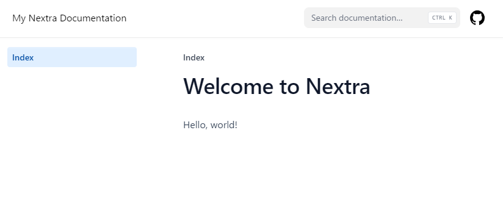

nextraは、標準でサイト内検索などを備えているNext.jsのテーマ。
ここではドキュメント向けのテーマを使用した手順を残しておく。

公式でデモページを用意してくれているので、使い勝手はこちらを確認すると良い。<br>
https://nextra-docs-template.vercel.app/

公式の手順を追っているだけなので詳細は公式を確認。<br>
https://nextra.site/docs/docs-theme/start


環境
----------------------------------------

* Node.js v18.17.1
* npm 9.6.7


プロジェクトの作成
----------------------------------------

```bash
mkdir -p nextra
cd nextra

npm i next react react-dom nextra nextra-theme-docs
```


package.jsonに起動スクリプトを追加
----------------------------------------

```bash
NEW_JSON=$(node -e '
json = require(`./package.json`);
json[`scripts`] = {
  dev: `next`,
  build: `next build`,
  start: `next start`
};
console.log(JSON.stringify(json, null, 2))
')

echo "$NEW_JSON" > package.json
```


Next.js構成ファイルを追加
----------------------------------------

```bash
echo 'const withNextra = require(`nextra`)({
  theme: `nextra-theme-docs`,
  themeConfig: `./theme.config.jsx`,
})

module.exports = withNextra({
  output: `export`,
  trailingSlash: true,
  skipTrailingSlashRedirect: true,
  images: {
    unoptimized: true,
  },
})

// If you have other Next.js configurations, you can pass them as the parameter:
// module.exports = withNextra({ /* other next.js config */ })
' > next.config.js
```


テーマ構成ファイルを追加
----------------------------------------

```bash
echo 'export default {
  logo: <span>My Nextra Documentation</span>,
  project: {
    link: `https://github.com/shuding/nextra`
  }
  // ... other theme options
}
' > theme.config.jsx
```


最初の1ページ目を追加
----------------------------------------

```bash
mkdir -p pages

echo '# Welcome to Nextra

Hello, world!
' > pages/index.mdx
```


起動確認
----------------------------------------

開発モード。

```bash
npm run dev
```

http://localhost:3000/

----

SSGしてプロダクションプレビュー。

```bash
npm run build; npx serve out
```

http://localhost:3000/

標準でサイト内検索機能なども備わっていて非常に使い勝手が良い。


