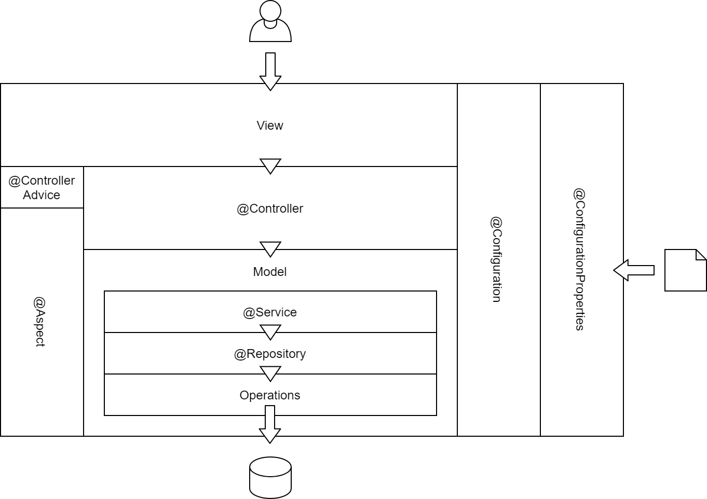
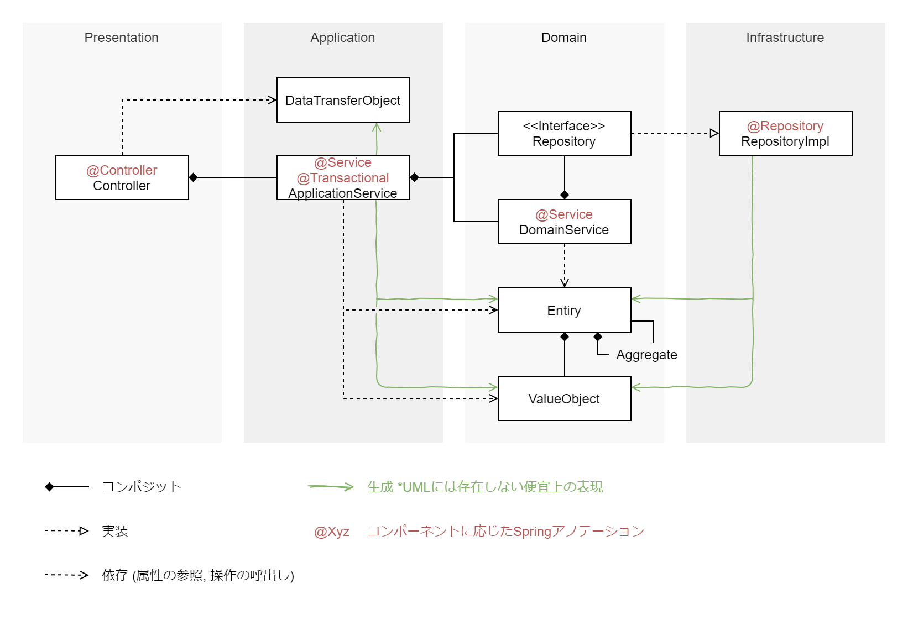

DDD が身近になり、適用ハードルもずいぶん低くなってきたように感じてきていたため、[以前のポスト](/spring-responsibilities) からところどころ書き直しました。

## レイヤードアーキテクチャ
Spring では各コンポーネントの責務に応じたステレオタイプアノテーションが用意されており、これらがどう連携するかについては、レイヤードアーキテクチャをイメージすると理解しやすいです。

Spring での各コンポーネントは、以下のように連携します。



また、いくつかのアノテーションは、ドメイン駆動開発にそのヒントを得て用意されているため、実際のクラスやパッケージの配置については、もう少し DDD に気を使ったものとするのが良いでしょう。

具体的には以前のポストでも使用した、以下の図を参考にしてみてください。

[トランザクションスクリプトとDDD](/ddd-transcript)



以下、各コンポーネントについて、簡単に説明してみます。


### View
Spring におけるビューは、一般的な HTML ページを構築するようなビューテンプレートだけを指すのではなく、あらゆるレスポンス (JSON, XML, CSV, PDF, etc..) を指します。


### Controller
コントローラーは、URL とアプリケーションサービスの呼び出しをマッピングし、リクエスト、およびレスポンスをハンドリングします。

共通的なロギング、例外ハンドリング、リクエスト、レスポンス加工等の横断的関心事については、後述する `@ControllerAdvice` を使用して実装し、コントローラーでは直接実装しません。

関連するアノテーションには、以下のようなものがあります。

- `@Controller` ([JavaDoc](https://docs.spring.io/spring-framework/docs/current/javadoc-api/org/springframework/stereotype/Service.html))
- `@RestController` ([JavaDoc](https://docs.spring.io/spring-framework/docs/current/javadoc-api/org/springframework/web/bind/annotation/RestController.html))


### Service
サービスは、状態を持たず、コントローラーとリポジトリーの間を取り持ちます。アプリケーション層と、ドメイン層に配置されるサービスはそれぞれ異なる役割を持っているため、混同しないように注意してください。

#### アプリケーションサービス
アプリケーションのユースケースを表現するためのサービス。_アプリケーションとして提供する機能_ についての実装を記述します。

#### ドメインサービス
ドメインオブジェクトたるエンティティや値オブジェクトを、客観的に評価したり、利用したりする機能についての実装を記述します。

ドメイン機能そのものについては、エンティティや値オブジェクトに表現します。より詳しくは以前のポスト [トランザクションスクリプトとDDD](/ddd-transcript) を確認してみてください。


### Repository
リポジトリーは、データアクセスを抽象化し、サービスから、物理的なデータアクセスの都合や実体を隠蔽します。

インターフェースは、コレクションを操作 (照会、追加、削除) しているかのような形で定義し、ここでも物理的なデータアクセスの実体が表からは見えないようにします。

関連するアノテーションには、以下のようなものがあります。

- `@Repository` ([JavaDoc](https://docs.spring.io/spring-framework/docs/current/javadoc-api/org/springframework/stereotype/Repository.html))


### Operations
オペレーションは、各種永続化技術を使う上での煩雑な手続きをラップし、使いやすく整えるためのインターフェースです。オペレーションを実装したクラスにはテンプレート (Template) という名前がつけられます。リポジトリーの具象クラスは DI によって Template を受け取り、これを使って外部リソースへの永続化を行ないます。

なお、オペレーションの実装であるテンプレートをプロジェクトの開発者が作成することはほとんどありません。多くの場合、Spring や、永続化技術を提供しているベンダー、またはそのサプライヤーから、ライブラリとして提供されるため、これを使用します。


### Aspect, ControllerAdvice
Aspect は AOP (アスペクト指向プログラミング) を実装するクラスに設定されるアノテーションです。横断的関心事 (共通的なロギング、例外ハンドリング、パラメタや返却値の加工等) を一元的に記述できるようにします。AOP を使用することで、サービスやリポジトリーから、煩雑で共通的な手続きを追い出すことができ、各レイヤーの責務に集中して開発できるようになります。

ControllerAdvice は、コントローラー向けの AOP 用アノテーションです。リクエストバインディングや、例外ハンドリング等、コントローラーのための便利な機能が利用できるようになっています。

関連するアノテーションには、以下のようなものがあります。

- `@Aspect` ([JavaDoc](http://www.eclipse.org/aspectj/doc/next/aspectj5rt-api/org/aspectj/lang/annotation/Aspect.html))
- `@ControllerAdvice` ([JavaDoc](https://docs.spring.io/spring/docs/current/javadoc-api/org/springframework/web/bind/annotation/ControllerAdvice.html))
- `@RestControllerAdvice` ([JavaDoc](https://docs.spring.io/spring-framework/docs/current/javadoc-api/org/springframework/web/bind/annotation/RestControllerAdvice.html))


### Configuration
コンフィグレーションは、DI コンテナに登録する Bean オブジェクトを構成、定義します。これは、旧来の Spring でたびたび使用されていた `applicationContext.xml` を、コードで表現できるようにしたものす。

関連するアノテーションには、以下のようなものがあります。

- `@Configuration` ([JavaDoc](https://docs.spring.io/spring-framework/docs/current/javadoc-api/org/springframework/context/annotation/Configuration.html))


### ConfigurationProperties
コンフィグレーションプロパティは、Bean オブジェクトの構成に必要となるプロパティを、外部から入力可能にするものです。コンフィグレーションプロパティでプロパティを外部に公開すると、`application.properties` や、システムプロパティ、環境変数といった様々な入力ソースから、[Reluxed Binding](https://github.com/spring-projects/spring-boot/wiki/Relaxed-Binding-2.0) という仕組みを使って、設定を取り込むことができるようになります。

関連するアノテーションには、以下のようなものがあります。

- `@ConfigurationProperties` ([JavaDoc](https://docs.spring.io/spring-boot/docs/current/api/org/springframework/boot/context/properties/ConfigurationProperties.html))


### パッケージ構成案
ここまでを踏まえ、パッケージ構成としては、どのようなものが考えられるでしょうか。(あくまで一案なので、自由に変更したり、自分なりの解釈で使いやすくして良いと思います。)

```
src/main/java/{base-package}/
|
|_ aop/
|  |_ {**}Advice.java
|
|_ presentation/
|  |_ {page-name}Controller.java
|  |_ {api-name}RestController.java
|  |_ {**}ControllerAdvice.java
|  |_ {**}RestControllerAdvice.java
|
|_ application/
|  |_ {usecase-name}Service.java
|
|_ configuration/
|  |_ {**}Configuration.java
|
|_ domain
|  |_ {domain-context-name}/
|     |_ {value-name}.java
|     |_ {entity-name}.java
|     |_ {entity-name}Repository.java
|     |_ {entity-name}Service.java
|     |_ {entity-related-name}Service.java
|
|_ infrastructure/
   |_ {datasource-name}{entity-name}Repository.java
```

概ねこのようなパッケージを用意しておくと、使いやすいのではないかと思いました。参考まで。
