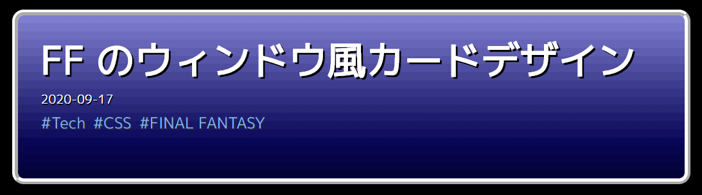
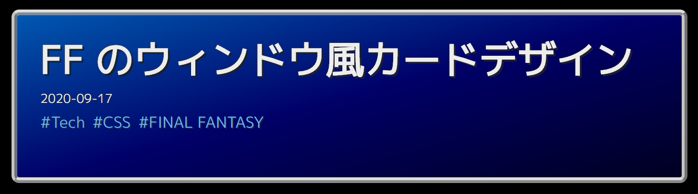
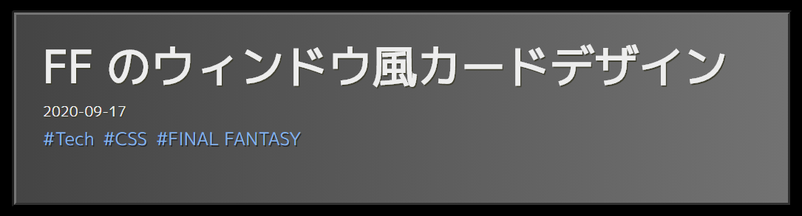
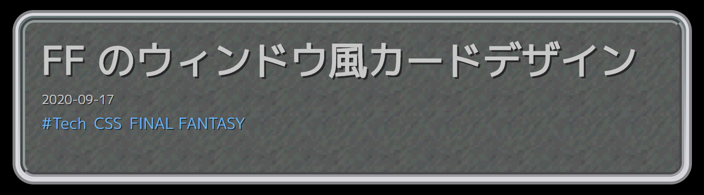

FF I - FF X までを再現した一覧は以下。

[/panels](/panels)

## FF6

```css
.window-ff6 {
    position: relative;
    margin: 0;
    padding: 1.5rem 1.5rem 1rem;

    color: #fff;
    text-shadow: #000 1px 1px;
    background: linear-gradient(
        180deg,
        #7b7bd6 0, #7b7bd6 5%,
        #7373ce 5%, #7373ce 10%,
        #6b6bc6 10%, #6b6bc6 15%,
        #6363bd 15%, #6363bd 20%,
        #5a5ab5 20%, #5a5ab5 25%,
        #5252ad 25%, #5252ad 30%,
        #4a4aa5 30%, #4a4aa5 35%,
        #42429c 35%, #42429c 40%,
        #393994 40%, #393994 45%,
        #31318c 45%, #31318c 50%,
        #292984 50%, #292984 55%,
        #21217b 55%, #21217b 60%,
        #181873 60%, #181873 65%,
        #10106b 65%, #10106b 70%,
        #080863 70%, #080863 75%,
        #00005a 75%, #00005a 80%,
        #000052 80%, #000052 85%,
        #00004a 85%, #00004a 90%,
        #000042 90%, #000042 95%,
        #000039 95%, #000039 100%
    );

    border-style: ridge;
    border-width: 6px;
    border-radius: 12px;
    border-color: #fff;
}
```




## FF7

```css
.window-ff7 {
    position: relative;
    margin: 0;
    padding: 1.5rem 1.5rem 1rem;

    color: #e6e6e6;
    text-shadow: #202020 1px 1px;
    background: linear-gradient(165deg, #0058b0, #000068, #000021);

    border-style: ridge;
    border-width: 6px;
    border-radius: 8px;
    border-color: #dedede #c5c5c5;
}
```




## FF8

```css
.window-ff8 {
    border-top: 2px solid #838383;
    border-left: 2px solid #838383;
    border-right: 2px solid #393939;
    border-bottom: 2px solid #393939;
    box-shadow: #292929 0 0 0 2px;

    background: linear-gradient(
            90deg, 
            rgba(68, 68, 68, 1) 0, 
            rgba(119, 119, 119, 1) 67%);
}
```




## FF9

```css
.window-ff9 {
    position: relative;
    z-index: 0;
    margin: 0px;
    padding: 1.5rem 1.5rem 1rem;

    color: #c8c8c8;
    text-shadow: #282828 1px 1px;
    background: linear-gradient(180deg, #6b7b7b, #d9d9de) 50% center;

    border-style: groove ridge ridge groove;
    border-width: 6px;
    border-radius: 22px;
    border-color: #d9d9de;
}

.window-ff9::before {
    content: '';

    position: absolute;
    z-index: -1;
    width: calc(100% - 4px);
    height: calc(100% - 4px);
    margin: calc(2px - 1.5rem) calc(2px - 1.5rem) -1rem;

    background-image: url(/images/ff9-bg.png);
    background-repeat: repeat;

    border-style: groove;
    border-width: 5px;
    border-radius: 15px;
    border-color: #939b9b #9c9ca1 #9c9ca1 #939b9b;
}
```


